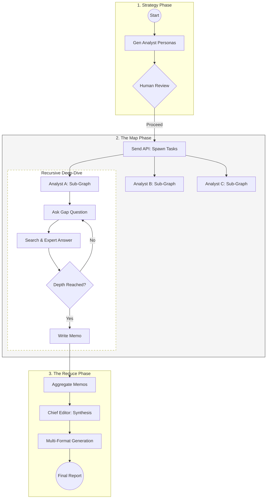
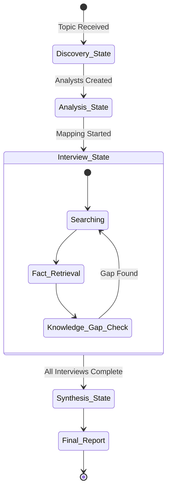

# DeepResearch Architecture

This document provides a technical deep-dive into the orchestration logic, data flow, and architectural patterns that power DeepResearch. The system is built around a stateful **Map-Reduce** design, optimized for high-precision information retrieval and synthesis.

---

## Technical Execution Flow

The system manages research as a state-machine. Below is the end-to-end journey of a research task, from initial setup to the final executive synthesis.

---

## State & Data Persistence

A unique challenge in long-running research is maintaining focus and memory. DeepResearch handles this through a structured state-evolution process.

### 1. State Evolution
The system state transitions from a "Discovery" state to a "Synthesis" state.

### 2. Memory & Threading
We use **`InMemorySaver`** to ensure thread-level isolation. Each research session operates in its own sandboxed context, preventing token leakage or state confusion between parallel analyst missions.

> [!NOTE]
> **Why Map-Reduce?** 
> By "Mapping" analysts to specific sub-tasks and then "Reducing" their findings, we avoid the context-window limitations often found in single-agent architectures. This allows for virtually unlimited research depth.

---

## Core Logic Modules

### The Interview Engine (`core/interview_builder.py`)
This is the most critical logic block. It implements **Iterative Drilling**. 
- **The Loop**: Each node evaluates the current information. If the data is vague (e.g., "The market is growing"), the agent is programmed to identify the lack of numbers or specific drivers as a "Knowledge Gap" and generate a follow-up query.
- **Tools**: Integrated with Tavily and Wikipedia to ensure every "Expert Answer" is grounded in real-world data points.

### The Synthesis Engine (`core/research_agent.py`)
This node acts as a **Global Aggregator**.
- **Golden Thread Identification**: It scans all independent memos for cross-analyst connections—identifying how a technical bottleneck found by one analyst might impact the economic forecast found by another.
- **Citation Preservation**: We use a robust indexing system to ensure that the URL sources from the "Map" phase are never lost during the "Reduction" phase.

---

## Visual Summary of Outputs

The engine doesn't just output text; it constructs a visual document:

| Component | Formatting Logic | User Value |
| :--- | :--- | :--- |
| **Technical Insights** | Blockquote Callouts | Immediate visibility for key findings. |
| **Comparative Data** | Markdown Tables | High-density data comparison at a glance. |
| **Strategic Links** | Inline Citations [1] | Trust and verifiability for every claim. |

---
*Sai Buvanesh*
